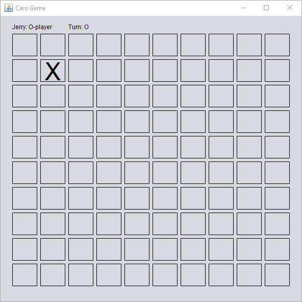

# Description
## Background
Caro (or Gomoku) is an abstract strategy board game and is also called Five in a row. It is traditionally played with go pieces (black and white stones) on a go board (19x19 intersections). This game is known in several countries under different names. In this game, there are two symbols: O and X. Players alternate in placing their symbols on empty intersections. The winner is the first player to get an unbroken row of five cells horizontally, vertically, or diagonally.
## Features
Caro is a small game that allows two players to play over the network. Each player should join the Caro game room with a name. After joining the room, a player can invite the other to play with. The inviting can give a preferred board size (NxN). The invited player should accept the invitation. For the first time, the game will randomly choose who is the X -player right after the invited accepts the inviting. When a game finished, a new game is started with the X-player is set to the player who was O-player in the previous game.
# Visuals
## Screenshots

\

